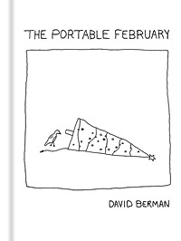

The portable February is a collection of David Berman's cartoons published in hardcover by Drag City in June 2009. The ISBN is 0982048017.

Running the gamut in topic and style from faux-political to faux–New Yorker, David Berman’s lo-fi cartoons incorporate strains of high and low comedy, wistful Americana, contemporary art, dream visions, and a visual analog to the semipenetrable personal allusions found in his music and poetry. His drawings invite the same deeper thought as his writings, making use of wordplay, cultural references, and offbeat observations. The sparse illustrations are complemented by poignant one-liners, and reveal moments of lightness within the author’s dark humor, providing a wry, erudite commentary on American culture.

## Reviews

### Magnet

_By Raymond Cummings_

Though he’s best known for fronting the late, great Silver Jews, sardonic, cerebral country rock isn’t David Berman’s only talent. He’s also a celebrated poet (see 1996′s dry Actual Air) and cartoonist whose drawings have popped up in the margins of The Baffler and adorned art-gallery walls. The Portable February (Drag City), his first published collection of illustrations, suggests that inkwell Berman isn’t far removed from plectrum Berman; the instruments of creation may differ, but the same bitterly amused tone suffuses both endeavors. February‘s 90-plus doodles range from crushingly obvious (the protester holding a sign reading “giants” enclosed by a circle with a line drawn through it, as a giant boot approaches from above) to gleefully inane sketches titled, perhaps, to impart meaning (“The World We Had,” “Irrational 15th Century Battle Scenes”) to oblique cartoons that demand serious interpretive input from the reader. What finally emerges is a bit droll New Yorker, a bit other-dimensional The Far Side and a bit psycho-social Steven, all at once: the anonymous “A Place In New Jersey” wearing its sketchiness all too literally; one animal remarking to another “Premise? I got premise,” when there’s no premise to speak of; a menagerie of rings and trophies; a raving, distended portrait captioned “If you were New Wave in Cincinnati in 1983, I probably haunted you occasionally.” February‘s genius lies in how its rudimentary squiggles manage to haunt again and again, each time in a slightly new way.