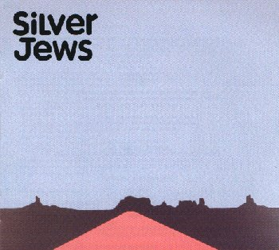

Released in 1998 as an LP and CD on Drag City (DC149) in America and Domino (WIG56) in Europe. 

## Tracklisting

1. [Random Rules](../songs/random-rules.html)
1. [Smith & Jones Forever](../songs/smith-and-jones-forever.html)
1. Night Society
1. [Federal Dust](../songs/federal-dust.html)
1. [People](../songs/people.html)
1. [Blue Arrangements](../songs/blue-arrangements.html)
1. [We Are Real](../songs/we-are-real.html)
1. [Send in the Clouds](../songs/send-in-the-clouds.html)
1. [Like like the the the Death](../songs/like-like-the-the-the-death.html)
1. [Buckingham Rabbit](../songs/buckingham-rabbit.html)
1. [Honk If You're Lonely](../songs/honk-if-youre-lonely.html)
1. [The Wild Kindness](../songs/the-wild-kindness.html)

## Credits

Produced by Nicolas Vernhes and The Silver Jews. Recorded at The Rare Book Room, Brooklyn. Mastered at Abbey Road, London. The American Water Band: Tim Barnes, D.C. Berman, Michael Fellows, Steve Malkmus, Chris Stroffolino. Cover painting by Chris Kysor. 
## Press Release

When David Berman was in New York this past spring recording the new Silver Jews album, American Water, he could be found almost any night of the week talking emphatically about something he called the 'New Openness". Part self-help, part spiritual agenda, part cocktail party schtick, the new openness is a kind of deliberately audacious honesty that allows us to say exactly what we are feeling at any given moment It shows up everywhere on American Water: "It is Autumn and my camouflage is dying", "I feel insane when you get in my bed", "Is the problem that we can't see, or is it that the problem is beautiful to me?"

American Water is adult music, a grown man's music, and on every track it's haunting with the confidence and apprehension of someone who has passed out in shadows and woken up under a flourescent glare. Bucolic and beleaguered, the album stands up with and assuredness and weary charisma that is a rare commodity in music these days and chilling to be near. The trapdoors and back alleys of personality that give dimension to Berman's songs are by turns scary, reassuring, and eerily familiar. In 'Like like the the the Death' he sings, "My life at home everyday / drinking coke in a kitchen with a dog who doesn't know his name / Oh right / it could have been anyone / grass, rabbits, grass, rabbits, grass. "Even if it's an elaborate ruse, the New Openness cuts right to the quick - something that might be said of American Water and the Silver Jews in general (granted the cutting may be more of a hunting, and the quick no more than a blur of personal contingency). 

A thrust of Silver Jews has always been to stir up the garbage of recieved emotions that makes most pop music a landfill of cop-outs. Comfortable with neither the bland expressionism of indie rock nor the platitudes of country music, Berman throws himself into the huge and obscure divide that yawns out below the typically American struggle to reconcile the mythic with the everyday. It's not enough to say that the Silver Jews sing about the small-time lives of rotten suburbs or the mundanities of growing older with only culture-addled no-sense of your-self. What's important in the Silver Jews music is the vortex of consequences - psychic or otherwise - that takes its toll whenever we try to have a good look at ourselves. Neither good lives nor bad lives are easy, and it's something extraordinary just to see a mirror for what it is.

Punctuated by Steve Malkmus' stoned guitar twang and occasional singing, Berman's baritone lyrics have a mid-thought seductiveness that is reminiscent of Dylan and Mayo Thompson, or John Phillips and Skip Pence - all of whom are experts at drawing in a audience with one hand and turning them back into the forest with the other. To his credit though, Berman seems to have had enough with wilful misdirection. A life of walking in circles will make one value steadfastness, if nothing else "I'm gonna shine out in the wild kindness" he sings on American Water's last, most poignant track "and spurn the sin of giving in. " How much longer must we inhabit this divine fork-in-the-road? Until we recognise the footprints trailing off behind us as our own. 

## Reviews

### Dazed & Confused, No. 48, November 1998

While some folk have been hammering square pegs into round holes trying to assemble a kind of low-fidelity, new country movement, bands like Silver Jews have carried on obliviously and have created one of the most beguiling records of the year.

Silver Jews third album, American Water, uses the forms and conventions of country and folk music without sinking into a stylised retro mire. Their work excels because, at a time when so many musicians rely on older forms of music to authenticate and window dress their increasingly tired artform, Silver Jews use traditional music as a canvas on which to paint their own unique impressions, "there's a responsibility in folk and country traditions to add to that tradition'" states Jews main man Dave Berman. "I think most people that play country music have dropped the ball just by fetishising it. " The remarkably tall Berman sucks a bloody mary through a straw while he explains and theorises about his music with wit and intelligence that befits the bands intriguing and elegant work. American Water fuses Bermans poetic eye with the cubist pop sensibilities of his band partner, Pavements Stephen Malkmus. With a book of poems due out in the new year, it's no surprise that Bermans lyricism is the major contribution to the bands achievement. "I see the music as a pedestal for the stories in the songs," says Berman, "But I want it to be as interesting as it can be before the point of intrusion. The music should be as simple as the stories are complex. "Berman is particuarly concerned with maintaining a truth and honesty in his work: an emphahsis on presence or charisma over manufactured or sanitised personality. "I don't make soundtracks to someones life. I'm not interested in making the listener the star. I still believe in the speaker and the listener, but I don't demand that anyone listens," he laughs. "I offer it out and if anyone wants to listen they can."

### Pitchfork 

_By Zach Hammerman_

After a dozen enjoyable listens, I popped American Water into the car stereo this weekend while cruising the hills of San Francisco and waited for a weak track. Forty- eight minutes and three record stores later I drove home convinced that D.C. Berman has crafted this autumn's most incredible record: twelve portraits of the American landscape that simultaneously beg to be played at every hour of the day, and reclaim the word "poetry" as part of the musical vocabulary. You heard it here first, folks. The Silver Jews have evolved from a Pavement side project into a full- fledged contender for the American indie throne.

American Water reunites Berman with Pavement frontman Steve Malkmus. It's not surprisingly then that most of the songs sound like they would have been just as at home on the last Pavement album, Brighten The Corners. The big difference? Someone must have convinced Malkmus he was Tommy Verlaine, because he delivers some of the most focused, inspired guitar work he's ever done. And then there's the addition of ex- Royal Trux bassist Michael Fellows, whose bluesy approach and punchy bass lines add immeasurably to the album's pastoral, timeless flavor. A muted horn solo here and some added textures there keep the arrangements fresh. It's obvious that a lot of thought went into this record, and every move pays off.

From the opening song, "Random Rules," you know the Silver Jews are onto something big, something which, in Berman's words, should be "hospitalized for approaching perfection. " The first half covers considerable territory, from the midnight execution epic "Smith and Jones Forever" to the journey from Malibu to South Dakota in "Federal Dust. " In the lilting pop ditty "People" Berman reels off in his laid-back twang one of many strokes of lyrical genius::  People ask people to watch their scotch.:  People send people up to the moon.:  When they return, well there isn't much.:  People be careful not to crest too soon.

On the album's second half, the Silver Jews expand their magna cum Pavement sound to include honky tonk ("Honk If You're Lonely" is sure to become a college radio classic) and a few Dylan-esque takes on the rambling blues ("We Are Real," "Like Like The The The Death"). As the titles suggest, it's not always clear what the heck Berman is singing about. But in the pauses, and in the obtuse phrasing of questions like, "Is the problem that we can't see, or is it that the problem is beautiful to me? ": somehow you know what he means.

Just how good is this album? A few years back I bought Silver Jews CDs to pass the time between Pavement releases. Now things may be the other way around. So all hail the Chosen People. It's time to take off your clothes and skinny dip in the American Water.

### Poetic Comedians Craft Charming Album

_By Douglas Wolk_

D.C. Berman's odd, wonderful little band the Silver Jews used to get dismissed as a Pavement side project, thanks to the presence of Steve Malkmus and occasionally another member or two of the better-known band. So last year's fine disc The Natural Bridge was entirely Pavement-free; his point made, Berman has invited Malkmus back for American Water, and it's their most entertaining and least difficult disc to date. Berman is a poet who's obsessed with American history and only incidentally a musician, though he's good at it; the artless charm of his voice is often bolstered by Malkmus' quasi-harmonies here, but his strummy, midtempo jangles are deceptively deep, avoiding easy structures and pop-song tropes. His language works the same way (for some of his poetry, have a look at the Drag City-published 'zine The Minus Times) - if the lyrics weren't printed in the booklet, his best stuff would seem a lot more normal than it is.

As you'd expect, there are some marvelous, arty, weird-as-hell lines here, like "The birds of Virginia are flying within ya/ and like background singers they all come in threes. " More seriously, though, he sings about wanting to "hold the world to its word," and his best songs are about trying to construct meaning from words in a world, and specifically an America, that tends to defy them. Song after song mentions a city or state, only to move on to another one in a line or two. Sometimes, his language avoids meaning altogether - one song begins "Like like the the the death/ Air crickets air crickets air crickets air crickets air" - but more often it skirts around meaning, as in "Blue Arrangements," a vague dance around the idea of shyness and passing into maturity.

Fortunately, Berman has some help from Malkmus, who, if he doesn't exactly have a habit of getting to the point, at least likes to act like what he's getting to is the point. His voice and guitar lines are unmistakable - musically, American Water's conversational murmurs and midtempo guitar eruptions are a logical next step to Pavement's Brighten The Corners, and the instrumental "Night Society" could be the tail-end of a successful Pavement jam. And the lines of lyrical and vocal influence seem to run both ways. It's hard to tell who's singing the coda of "not much water coming over the hill" again and again in "Federal Dust" or who came up with the idea of preceding it with the line "here comes the coda. "Which leads to another thing that people tend to miss about the Silver Jews: how damn funny they are, and how dry that funniness is. American Water's spine hosts a great little joke, which I won't spoil here. "Honk If You're Lonely Tonight" is either a swell country song or a swell parody of a country song, and most likely both. Berman's jokes, and his more general embrace of absurdity-through-poetry, make sense as a response to a country that's too big to be held together by an idea of place, and they try to compensate by holding themselves together through barely meaningful language.

### The List

_By Paul Whitelaw_

David Berman and Pavement's Steve Malkmus return with their third album of minor chord classics. American Water's stories are of tired travellers, jilted lovers and especially dedicated drinkers. It keeps a fairly respectable late Velvets pace, with occasional gear shifts in it's more Pavement-esque moments such as 'People' and the strangely titled 'Buckingham Rabbit'. Elsewhere the darker side of coffee house life is explored in the Mid-West phobia of 'Federal Dust'. But the greatest moment doesn't arrive until 'Honk if you're Lonely', an hilarious bumper sticker inspired, C&W pastiche with a catch-line of 'C'mon toot your horn and flash me those lights, Honk if you're lonely tonight'. Another future classic.

### Mojo

_By Sylvia Simmons_

Writer-cartoonist David Berman reunites with Pavement's Stephen Malkmus for third album.

When David Berman recruited a band to play his songs, he called upon college pals Malkmus and Bob Nastanovich of Pavement fame. Then, though going on to christen their first three albums, dispensed with their services after Silver Jews' debut, Starlite Walker, cutting the more introspective The Natural Bridge two years later. Now Malkmus is back in fold, and American Water sounds like a cross between his early outings and Berman's short-story songs and flat, world-weary voice (All my favourite singers couldn't sing", he croons in We Are Real; and I couldn't agree more) coalescing with Pavementy flourishes and Malkmus's backing vocals. At times it's like Will Oldham and a down-at-heel Lou Reed discussing love, life and death at an after hours bar. Sharp lyrics ("I know a lot of what I say has been lifted from men's room walls"), smart, distinctive pop and fine alt country best sampled on the melancholic Federal Dust and good-ol'-boy sing-along Honk If You're Lonely.

### Philadelphia Weekly

_By William Ricchini_

Often thought of as a Pavement side project, country-folksters the Silver Jews is really southern poet/songwriter Dave Berman. For the fourth Silver Jews record, American Water, Pavement's Stephen Malkmus returns for lead guitar after sitting-out for Berman's last effort, the terrific The Natural Bridge. American Water is easily the most fully realized collaboration between Malkmus and Berman yet. Berman's gorgeous country-tinged ballads are designed to showcase his lyrics, but Malkmus makes the most of the minimalist arrangements, adding subtle guitar lines he'd never play on a Pavement record. Malkmus has his hands all over this record, most noticeably on "Send in the Clouds," where Malkmus' riffing lures Berman's folk into anthem rock. But amidst the added sonic punch, the best thing about this record is Berman's words. His conversational southern drawl delivers his bumper sticker proverbs with elegance. He still can't sing worth a damn, but when he chants "all my favorite singer couldn't sing" on "We Are Real" you can hear a chorus of Dylan fans cheering in approval.