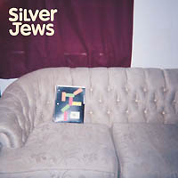

Released in 2001 as an LP and CD on Drag City (DC215) in America and Domino (WIG106) in Europe. 

## Tracklisting

- [Slow Education](../songs/slow-education.html)
- [Room Games and Diamond Rain](../songs/room-games-and-diamond-rain.html)
- [Time Will Break the World](../songs/time-will-break-the-world.html)
- [I Remember Me](../songs/i-remember-me.html)
- [Horseleg Swastikas](../songs/horseleg-swastikas.html)
- Transylvania Blues
- [Let's Not and Say We Did](../songs/lets-not-and-say-we-did.html)
- [Tennessee](../songs/tennessee.html)
- [Friday Night Fever](../songs/friday-night-fever.html)
- [Death of an Heir of Sorrows](../songs/death-of-an-heir-of-sorrows.html)

## Credits

Engineered and produced by Mark Nevers. Assistant produced by Michael Fellows. Recorded at Hum Depot, Berry Hill, TN. Mixed at Wedgetone, Nashville, TN. Mastered at Abbey Rd., London, August 2001. Musicians: David Berman, Mike Fellows, Tim Barnes, William Tylor, Tony Crow, Paul Niehaus, Cassie Marret. 

## Reviews

### The Stranger

_By Kathleen Wilson_

I've never been the type to find something to get depressed about within truly uplifting content. For example, I've always become secretly contemptuous whenever Harry Nilsson's "Everybody's Talkin'" comes on and some groaner starts wailing about what a depressing song it is. Sure, Midnight Cowboy is a dispiriting film, and it's difficult to separate the song from the soundtrack. But lyrically - however ironic the film's course makes it seem - the song remains, at its heart, a gorgeous, hopeful promise of brighter places. I experience the same uppity reaction when wistful artists such as Simon Joyner, Rock*A*Teens, the New Year, and Silver Jews are, in my opinion, wrongly referred to as bleak.

Now, more than ever, what we all need is a promise of brighter places. A promise to get away. An opportunity to see things happen in states we've never been to. Transportation. Right now, though, most of us are apprehensive about travel, and whether it's because we're scared shitless or just low on cash, a lot of us don't have plans to go anywhere for a good long while.

Which is what makes an album like the Silver Jews' Bright Flight the perfect gift for someone who needs to be transported without leaving the confines of home. Any Silver Jews record is fraught with picturesque visions, set forth by lead band member David Berman, whose crooked prose and wandering melodies read like vivid chalk paintings scratched on a sidewalk by a storyteller who's mastered the art of quick, inspired illustration.

Like snapshots of a trip, Berman's deeply Southern lyrics catch the nearly missed poignancy in a simple rhyme such as "Marry me, leave Kentucky and come to Tennessee/'Cause you're the only ten I see. " It's the earlier, off-hand revelation that her doorbell "plays a bar of Stephen Foster" that unfurls a lifetime of intimate details, and the listener becomes an emotional patron of this imaginary couple set on moving ahead.

In "Room Games and Diamond Rain," Berman's got you drinking wine in the afternoon shade, imagining a freight train that rattles a chandelier, and taking a ride in the dirt. If that's too mundane, a moment later he's got you thinking about plug-in reindeer whose cords can't stretch far enough to fly. Whimsical sadness, mixing with the wine and the shade and the dirt, transports the listener to the kind of escape reality can't allow. Horses' legs become brown shotguns, and countrysides have trapdoors where you can disappear among giant evergreens. Suddenly a January trip to Mexico seems shallow and boring.

Berman is also an acclaimed poet, whose book Actual Air reads like a novel written in two-sentence paragraphs. His observations are searing and economical, poignant, and, more often than not, hilarious. An on-duty museum guard muses, "No one gets hungry at the sight of a lush cornfield or a herd of cattle. It's enough to tell you that we're full of education, not awareness. " Again, Berman is offering a windshield view of the countryside, as seen through the eyes of a character we'd never have a chance of knowing except through a storyteller's proxy.

Silver Jews began in 1989 when Berman, Stephen Malkmus, and Bob Nastanovich were living in New York after studying at the University of Virginia. Concurrent with Pavement, Silver Jews were often thought of as a Malkmus side project, but Berman's talents led the band. After Chicago's Drag City label released two super lo-fi EPs, Berman returned to college and studied writing, only to rejoin Malkmus and Nastanovich in 1994 on Starlite Walker. The following album, The Natural Bridge, was the one on which Berman's stark songwriting and streamlined musicianship came to the fore. Those abilities remained strong on 1998's American Water, the album on which the singer was reunited once again with Malkmus.

Bright Flight is Berman's purest testament to his singular talent. The songs within are devastating and reviving in their ability to transcend time and place. The stories told and the places visited are rich with radiant imagery--not always happy, but encouraging in their pure, honest existence. "One day they were cutting flowers for something to do/On the band of the road 'neath the cottonwoods/He turned to her to ask if she'd marry him/When a runaway truck hit him where he stood. " The guy lives, she marries someone else, and Berman sings, "I'm just rememberin', I'm just rememberin'. " And, like we were there, we'll remember it too.

### Neumu

_By Jillian Steinberger_

In over a decade, the Silver Jews (AKA David Berman and whoever he chooses to record with) have never quite fit into the musical landscape, existing in a genre twilight zone, subverting the codes. Berman makes his own rules and doesn't always follow them. His roots are in the music of American youth when he was coming up in the '80s - punk. He records for Drag City, an indie label. On both his latest album and his EP, Berman identifies most closely as a countrified artist - although his music is beyond country and alt.country and tacitly offers a criticism of both.

Berman's often compared to rock heavyweights. Bob Dylan, for example, although they don't share much beyond common ancestry and a voice with a bit of scratch. Lou Reed? That might be valid, since the band has an early seven-inch called "The Silver Jews and Nico" (1993) - but it's not. While they've been compared to Neil Young, The Jews are not like Neil Young - they are wry, post-modern. As for Tom Waits, Berman's voice is hardly the same gravelly bear, and the songs differ vastly in tone and texture. And although the Silver Jews have been seen as a Pavement side project (members of that now-defunct über-indie supergroup play on previous albums, but not this one), it isn't. The Jews are so often misunderstood.

There's a boho masculinity about the Silver Jews' music. Lore has it the "band" (originally called Ectoslavia) began as a trio of University of Virginia, Charlottesville, graduate students (Berman, plus ex-Pavement members Stephen Malkmus and Bob Nastanovich) sitting among beer cans and cigarette butts, inventing lo-fi tunes for friends. Eventually they moved to New York and left the little songs on people's answering machines (including Sonic Youth's, whose number they reputedly finagled from a girl at a record store).

While his sometime bandmates dabbled with stardom, the apparently incorruptible Berman has stuck to his indie roots. He refuses to tour, saying he's not a performer, and live performances offer no value above and beyond the recorded songs. Yet he does make appearances, drawing caricatures at record stores, most recently in New York (Kim's on St. Mark's Place) and London (Rough Trade, for one quid). Very common-sense in Berman's world.

An MFA in Creative Writing and published poet, Berman emphasizes the lyric, with no shortage of attention to songwriting or musicianship. He is the author of "Actual Air" (Open City, 2000) and numerous pieces in that beloved Situationist rag, The Baffler. Richard Brautigan, psychedelic beat author of deep teen fave "In Watermelon Sugar," comes up regularly as a comparative reference.

At Berman's request - and to their purported disappointment - Malkmus and Nastanovich have taken a break from the latest project, although word is they'll return for future recordings. To protect the Silver Jews from the continued perception of Pavement-side-project status (the opposite could be argued), Berman opted for experienced studio musicians. Props to them; they play beautifully together and with Berman. William Tyler plays acoustic and electric guitar, while Lambchop member Paul Niehaus, who has sessioned with Yo La Tengo, adds slide and twang with wave table and pedal steel guitar. Keyboards go to Tony Crow (Lambchop). Michael Fellows (Royal Trux, Rites of Spring) returns with his bass from the Jews' 1998 release, "American Water," with drummer Tim Barnes. Cassie Marrett adds a welcome female dimension, and Berman has found his vocal female doppelganger in her sweet, textured, country-punk voice.

Closer listenings, particularly to the LP, reveal how grounded it is in its sense of place and history. Overall, the new work seems to be about movement and making tough choices - having the courage to live life according to one's vision and determining one's destiny. It is about what happens if you don't. It is about yearning - to be a better person, for communion with another, for a better world. It is about when the masculine joins the feminine and the worthwhile challenges of negotiating long-term romantic partnerships. It is packed with images - screen doors banging in the wind, freight trains rolling West, God when he was young, plug-in reindeer, floating hatchets and rhinestone suits. It is about the South - a condemnation of hypocrisy, rednecks, horseracing, guns and throwing in the towel too early. And it recalls and questions the meaning of American history.

The songs are by turns tender, sweet, sexy, wry, tragic and mournful. Some are romantic ("Tennessee," "Room Games and Diamond Rain"), while others are spiritual ("Slow Education", "Death of an Heir of Sorrows"). "Slow Education" opens Bright Flight; the album's first lyrics soothe the weary adult soul ("When God was young, he made the wind and the sun/ And since then, it's been a slow education"). "Everybody's going down on themselves" in this NC-17 lullaby, featuring Berman's none-too-scratchy vocals and Marrett adding a pretty backup. I like the rhythm, the keyboards are right on, the guitars dish out the perfect twang, and even George Washington makes an appearance. "Room Games and Diamond Rain" follows. Again, the rhythm's on the mark and that same pretty twang from "Slow Education" weaves in. The song's about settling into romantic commitment; the affecting melody and rhyming lyrics might get schmaltzy ("You keep finding and reminding me/ That you only can be kind to me"), but the chorus takes it in other direction, presenting a kaleidoscope of compelling images ("It's a fox hunt, it's an f-stop/It's a ten-acre wood") that balance the song out. Sweet but contemplative, "Room Games" is one of my favorite songs on Bright Flight. I like how it sounds, what Berman talks about and the way he expresses himself - it's tender, but not saccharine.

Some of Berman's songs have an onomatopoetic quality. Many songs in the history of country have sounded like trains (Johnny Cash's "Folsom Prison Blues" is a good example). On Bright Flight I do believe I've heard my first horse-galloping song, the instrumental "Transylvania Blues" - horse-galloping music from a fourth-generation, Southern Fried, American Jewish perspective. (Overall, the instrumentals are respites from the intense lyricism of the songs.)The 4-song EP, "Tennessee," was a teaser released two weeks before the 10-song Bright Flight. I figure Berman didn't include the other tracks on the album because they didn't fit Bright Flight's narrative thrust. On both the EP and LP, "Tennessee" is the centerpiece, the heart, of the new work.

Berman conveys his agenda with two unsubtle lines, "Punk rock died when the first kid said/ 'Punk's not dead, punk's not dead.' " (A friend argues that it died when Joe Strummer got his teeth fixed.) With this shout-out, D.C. says he's not working in a vacuum. He's drawing from tradition (punk), but he's not stuck in it. Berman appeals to youth as if to say, "Think for yourself. Invent new forms; don't trot out the old tired forms. " It's an important message, and typical Berman.

In "Tennessee" the narrator hits the road with his gal pal and flees to Nashville. Acoustic guitar lends a folky feel, while electric guitars provide a twangy lead and an airy Western texture. Marrett's voice and delivery are perfect on this duet.

The line, "Louisville is death" has caused speculation that Berman uses "Tennessee" to reveal a distaste for this significant village in the world of indie, one that developed while living with his girlfriend while she finished school. Louisville's indie stars include Berman's Drag City label mates, Will Oldham (Bonnie Prince Billy, Palace) and David Pajo (Papa M/Aerial M, Slint, Tortoise), neither of whom play often in their hometown. Bob Nastanovich has claimed that Louisville is only good for compulsive gamblers, and that the punk and indie scenes have died. The image of "Horseleg Swastikas" and lyrics like "My horse's legs look like four brown shotguns" ("Time Will Break the World") evoke a town populated by fascists perverting nature at the racetracks. Hence, the male voice's desire in "Tennessee" to make for Nashville, where he can juggle with the rubble of Southern music and build something new.

On the EP, "I'm Gonna Love the Hell Out of You" is a sexy number heavy on guitar, tambourine and Berman telling a story about a "Christian rock ingenu" who wants to "love the hell out of you. " Where are those Nancy Sinatra boots when you need 'em? This song makes you want to stomp around on the table tops. If you don't know how that feels, listen and you'll know. The most fun of Berman's new crop, it works on the EP but would have disrupted the flow of the somber, introspective LP. A demo was originally released as a Jane Magazine CD.

Berman originally drew me in with a deja vu line that captured a previously unarticulated concept: "We're trapped inside the song," he and Malkmus wailed in "New Orleans" on 1994's Starlite Walker. Now I'm trapped inside Berman's latest project. And I love this rebel Jew.(Note: Bright Light gets an "8" rating; the "Tennessee" EP gets a "6" rating.)

### The Independent Mind

_By Greg Peterson_

> I am trying to get at something and I want to talk very plainly to you so that we are both comforted by the honesty. - D.B. 

The first thing I noticed about this album was the Webb Pierce LP in the back photo. Then I noticed the little scorpions on David Berman's blue western shirt. Right now I'm looking at the front cover and thinking that the notebook pictured there is sitting on the couch with good posture, its back very straight. Bright Flight is the fifth full length from Silver Jews, who are not a Pavement side-project. If you didn't figure that out a long time ago, you should be figuring it out now. I heard someone say once that it's actually the other way around. Silver Jews existed before Pavement, and they're still existing now that Pavement is gone. Pavement's S.M. was not involved in making Bright Flight or The Natural Bridge, which was the third album. S.M. has an ear for perfect angular guitar lines that stick in your head like burrs on flannel, and for silliness. David Berman, on the other hand, writes poems (refer to Actual Air, Open City, 1999). The difference between his songs and poems is that the latter rhyme less often. A word on the silliness: here it has been carefully sewn up with nostalgia and melancholy. The lyrics are perhaps more direct than ever, but still the songs evaporate at their end (or mid-song, only to be re-assembled in a new way, as in "I Remember Me") and leave this listener with a certain mood rather than distinct memories or impressions. Some lyrics on a common theme: that one idea again, the one about dying; die until it doesn't hurt; time will break the world; killed you in my mind so many times before; chased by a floating hatchet; punk rock died…; death of an heir of sorrows; you'd died alone. All the best country music sounds to me like it's coming from someplace beyond this life, even if the singer is still living. (Example: Lambchop's Kurt Wagner. Note: Lambchop's occasional member Mark Nevers engineered and produced Bright Flight, giving it that special Nashville sound, if you're one to believe that a sound can linger in a locale like fog in a valley.) And maybe that's the problem with a lot of what passes for country music today. No one sings about death anymore. And please don't tell me that you're a Ryan Adams fan. But now I'm sounding bitter. These songs are not bitter. The pedal steel floats above them like an angel: child-like hope rolled up with a jaded acceptance of the end. Berman's deadpan sung-spoken delivery hits right between your eyes with the headphones on, and half the time he seems on the verge of tears. When he says "I'm drunk on a couch in Nashville," I believe him. His songs are the best when you can sing along with him, and here's the verse that I learned first (join me when you can):

> I wish I had a thousand bucks, I wish I was the Royal Trux, but mostly I wish I was with you. - D.B.